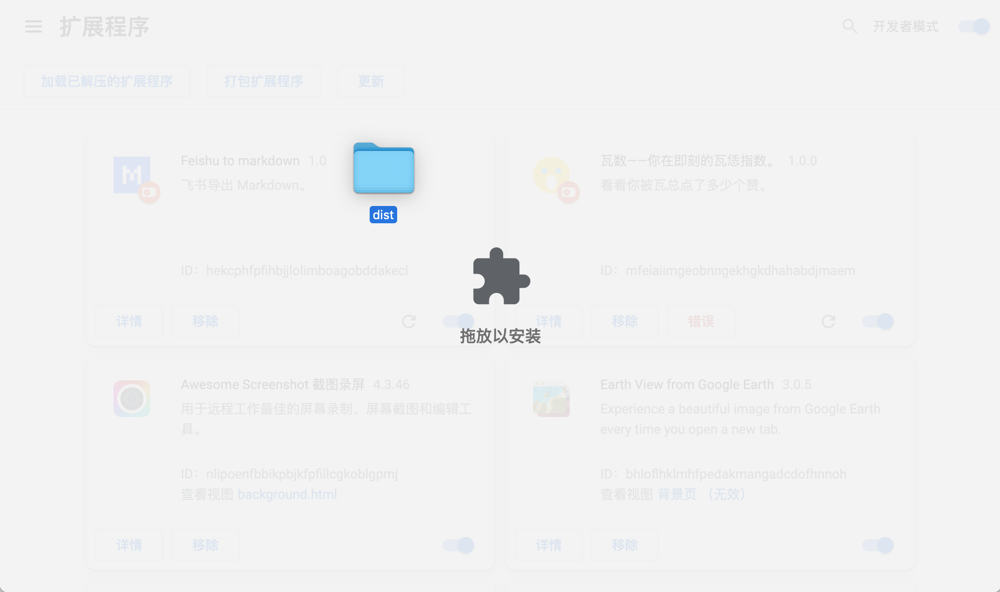

# Feishu to Markdown

> ⚠️ This project is in WIP

## Usage

- Download zip file in [release page](https://github.com/leadream/feishu-to-markdown/releases)
  

- Open `chrome://extensions/` in Chrome and enable developer mode
  

- Unzip and drag the folder to this page
  

- Open a doc page, wait for all images and videos loaded (scroll slowly to load every media). Click the download button at bottom to export markdown.
  

## Development

Dev mode

```
yarn dev
```

build production

```
yarn build
```
